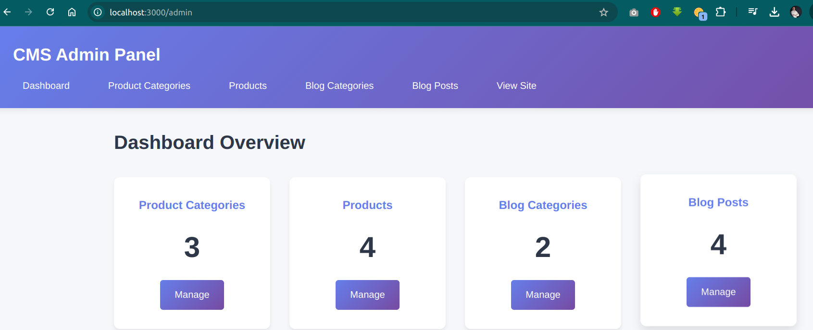

# Rust CMS - Content Managment System

A modern and powerfull Content Management System built with Rust, featuring an admin panel and public-facing e-commerce and blog functionality.

## Features

- **Admin Panel**: Complete managment interface for products, categories, and blog posts
- **E-commerce Shop**: Browse and view products organized by categories
- **Blog System**: Publish and manage blog articles with category organization
- **Modern UI**: Clean and responsive design that works on all devices
- **Fast Performance**: Built with Rust for blazing fast performance

## Technology Stack

- **Rust**: Core programming language
- **Axum**: Web framework for building the server
- **Tokio**: Async runtime for handling concurrent requests
- **In-memory Storage**: Simple data storage (can be replaced with database)

## Getting Started

### Prerequsites

- Rust 1.70 or higher
- Cargo (comes with Rust)

### Installation

1. Clone the repositry:
```bash
git clone https://github.com/yourusername/rust-cms.git
cd rust-cms
```

2. Build the project:
```bash
cargo build --release
```

3. Run the application:
```bash
cargo run
```

The server will start on `http://127.0.0.1:3000`

## Usage

### Accessing the Application

- **Public Homepage**: http://127.0.0.1:3000/
- **Shop**: http://127.0.0.1:3000/shop
- **Blog**: http://127.0.0.1:3000/blog
- **Admin Panel**: http://127.0.0.1:3000/admin

### Admin Panel Features

The admin panel provides complete control over your content:

1. **Product Categories Management**
   - Create new product categories
   - View all existing categories
   - Delete categories

2. **Product Management**
   - Add new products with name, description, price, and stock
   - Organize products by category
   - Remove products from the system

3. **Blog Categories Management**
   - Create categories for blog posts
   - Organize your blog content

4. **Blog Posts Management**
   - Create new blog posts
   - Publish or unpublish posts
   - Organize posts by category
   - Set author information

### Public Site Features

The public-facing site provides a great user experiance:

- **Shop Page**: Browse all available products with pricing and stock information
- **Blog Page**: Read published articles organized by category
- **Responsive Design**: Works seamlesly on desktop and mobile devices

## Project Structure

```
rust-cms/
├── src/
│   ├── main.rs              # Application entry point
│   ├── store.rs             # Data storage layer
│   ├── models/              # Data models
│   │   ├── mod.rs
│   │   ├── product.rs       # Product model
│   │   ├── category.rs      # Category model
│   │   ├── post.rs          # Blog post model
│   │   └── blog_category.rs # Blog category model
│   └── handlers/            # Request handlers
│       ├── mod.rs
│       ├── admin.rs         # Admin panel handlers
│       └── public.rs        # Public site handlers
├── static/
│   └── css/
│       ├── admin.css        # Admin panel styles
│       └── public.css       # Public site styles
├── Cargo.toml               # Project dependancies
└── README.md
```

## Development

### Running in Development Mode

For development with auto-reload, you can use cargo-watch:

```bash
cargo install cargo-watch
cargo watch -x run
```

### Building for Production

```bash
cargo build --release
./target/release/rust-cms
```

## Sample Data

The application comes with pre-loaded sample data including:

- Product categories (Electronics, Clothing, Books)
- Sample products in each category
- Blog categories (Technology, Lifestyle)
- Published blog posts

This sample data is perfect for testing and demonstration purposes.

## Future Enhancements

Some ideas for future improvements:

- Database integration (PostgreSQL, SQLite)
- User authentication and authorizaton
- Shopping cart functionality
- Order managment system
- Image upload for products
- Rich text editor for blog posts
- Search functionality
- Comments on blog posts
- Email notifications

## Contributing

Contributions are welcome! Feel free to submit pull requests or open issues.

## License

This project is open source and available under the MIT License.

## Screenshots

### Admin Dashboard


### Product Management


### Public Shop


### Blog


## Acknowledgments

Built with love using Rust and modern web technologies. Special thanks to the Rust community for creating amazing libraries and tools.

